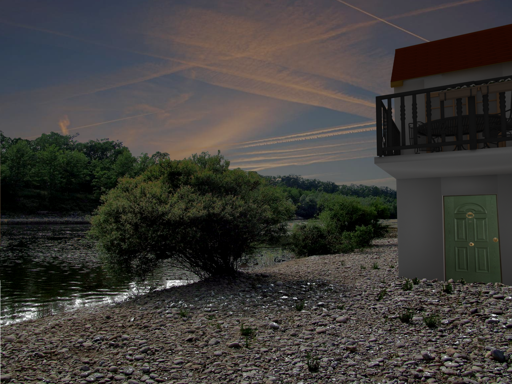

# open_source_architecture_rendering
That include a toy example made for studiing how to create architecture render with opensosurce software

The working pipeline
* SweetHome3D: create house and export .obj
* fSpy: analize the prospective of an image and export a camera
* Blender (with fspy plugin): import camera, place object and render with alpha background
* GIMP: mount images togheder

